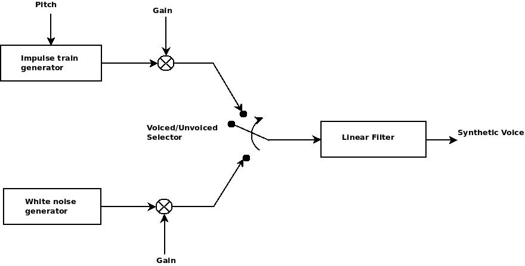
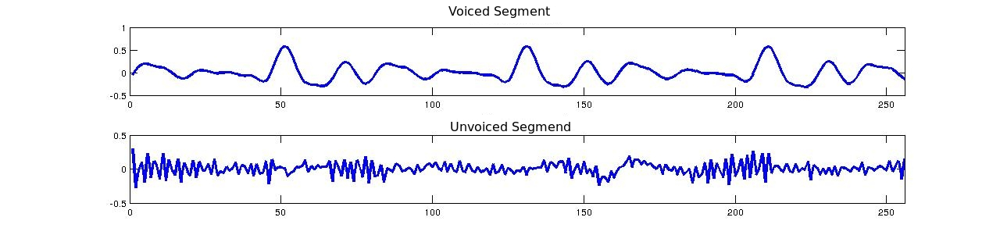

==========================
Theory of operation [#f1]_
==========================

Linear Predictive Coding (LPC) is a parametric representation of the speech
signal, it is used to reduce the amount of information needed to reconstruct
the speech signal, the LPC vocoder is one of the easiest vocoders to implement.

This is a source-filter model that represents speech signal as a combination of
a source (vocal cords) and a linear filter (vocal tract).

Speech Analysis
---------------
The speech signal is, by nature, random and it can only be analyzed on small
segments (frames) of 10 to 30 ms. For this we use a *Hamming* window to split
the signal into usable frames that will be analyzed individually and, on the
synthesis we use the and the *Overlap and Add* method to reconstruct the signal
from its frames.

Speech Synthesis
----------------
As mentioned previously, it is possible to model an speech signal based on the
source-filter model:

For this model the lineal filter is based an all-pole filter that represents the
vocal tract:

.. math::
    H(z) = \frac{G}{ 1 + \sum_{k=1}^{N} a_{k} z^{-k}}

Where the :math:`a_{i}` coefficients can be obtained using the well-known
Wiener-Hopf equation:

.. math::
    R_{p}\vec{a}_{p} = -\vec{r}_{p}

Which can be expressed as a matrix:

.. math::
    \begin{bmatrix}
        r_{0} & r_{1} & ... & r_{p-1} \\
        r_{1} & r_{0} & ... & r_{p-2} \\
        .     &   .   &  .  &  .      \\
        .     &   .   &  .  &  .      \\
        .     &   .   &  .  &  .      \\
        r_{p-1} & r_{p-2} & ... & r_{0} \\
    \end{bmatrix}
    \cdot
    \begin{bmatrix}a_{1} \\ a_{2} \\ . \\ . \\ . \\ a_{p}\end{bmatrix} =
    \begin{bmatrix}r_{1} \\ r_{2} \\ . \\ . \\ . \\ r_{p}\end{bmatrix}

Where :math:`p` is the prediction order (order of the filter) and with
:math:`\vec{r}_{p}` being the autocorrelation vector the speech signal
(:math:`r_{i}` being the items of the vector).

The gain of the signal can be calculated using:

.. math::
    G = \vec{a}_{p} \cdot \vec{r}_{p}

Pre/De-emphasis filters
-----------------------
The frequencies of the speech signal are largely concentrated on the lower-end
of the spectrum, so it's common to apply a high-pass filter to enhance the high
frequencies and generate a better model, this filter is applied before the
analysis of the signal and, in contrast, during the synthesis a low-pass filter
should be applied to counter the effects of the hig-pass filter. These filters
are called pre-emphasis and de-emphasis filters and are defined as:

* pre-emphasis
    .. math::
        H(z) = 1 - \alpha z^{-1}

* de-emphasis
    .. math::
        H(z) = \frac{1}{1 - \alpha z^{-1}}

with :math:`\alpha=0.9375`

Sound Classification
--------------------

Speech segments can be classified according to their excitation mode:

* Voiced
    This sounds are produced by the excitation of the vocal cords and
    fundamental frequency called **pitch**, and can be represented as a train of
    impulses with period equal to the pitch.

* Unvoiced
    This kind of sound is produced by the turbulence of the air while passing
    through the vocal tract, and can be modeled as white noise.

The following figure shows the difference of a voiced and unvoiced signals:

.. [#f1] All this work is based on `my bachelors project <http://132.248.9.195/ptd2014/junio/0714485/Index.html>`_
